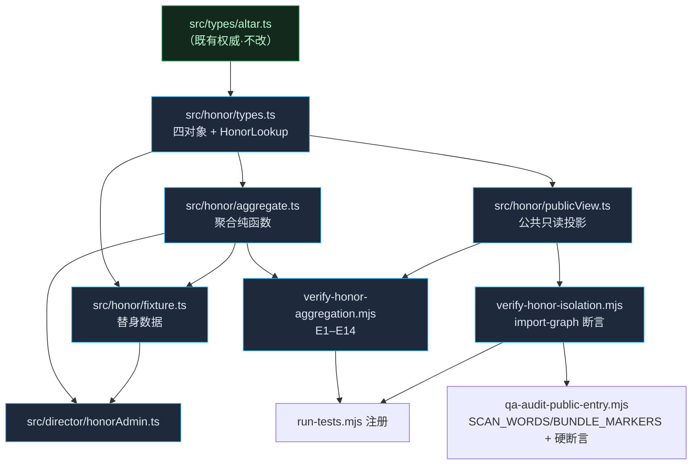

# #6 荣誉层数据聚合 · 四对象模型与 ASN 边界 —— 设计说明书

> **Gitea**：`[v2.0][P0] 荣誉层数据聚合：四对象模型与 ASN 边界`（#6）
> **里程碑**：祭坛 v2.0：三十分钟仪式交付
> **作者**：高见远（架构师） · **性质**：契约与边界设计（**不含产品代码**）
> **上游规范**：`docs/荣誉座次表规范.md`（座次/凭证唯一权威）、`docs/身份与相机权限规范.md`、`无人值守自运维华夏祭坛_Agent修正案提案_实施规范.md`
> **本说明书基线 HEAD**：`b6a93805c468afba7755d9551e1b4389bbd9ad77`

---

## 0. 本说明书的事实基线（全部为本会话真实执行回显）

> 本仓库已出现 4 次「报告说完成、实际未落地」。因此下文每个 hash / 路径 / 断言数，均标注来源。**未实测的一律标注「未验证」。**

### 0.1 仓库状态

| 项 | 实测值 | 来源 |
|---|---|---|
| HEAD | `b6a93805c468afba7755d9551e1b4389bbd9ad77`（`test(qa-audit): #5 入库公共入口独立审计（DOM/bundle/网络三层）`） | `git rev-parse HEAD` |
| 工作区 | 干净（`git status --short` 空） | 同上 |
| **与派单的差异** | **派单写 HEAD=`4647199`，实测 HEAD 已前进一级到 `b6a9380`。** `4647199` = `test(qa-gate): #5 采纳 QA 加固的路由断言 + 中性 chunk 名 chunk-[hash]`，确实存在，但非当前 HEAD | `git log --oneline -3` |
| #3 commit `76ae026` | 存在：`feat(wuji): #00 无极点吸光体 · 不可占有 + 时间码显形（#3）` | `git show --stat 76ae026` |

### 0.2 时限/音域权威（`src/types/altar.ts`，实读）

| 符号 | 值 | 行 |
|---|---|---|
| `WUJI_ANCHOR_ID` | `0` | :181 |
| `SEAT_ID_MIN` / `SEAT_ID_MAX` | `1` / `49` | :184-185 |
| `isSeatId(id)` | `Number.isInteger(id) && id >= 1 && id <= 49` | :192-194 |
| `WUJI_REVEAL_SEC` / `WUJI_SILENCE_SEC` | `1440` / `1751` | :201-202 |
| `wujiRevealStateAt(sec)` | `hidden` / `revealed` / `silent` | :211-215 |
| `RITUAL_TOTAL_SEC` | `1800` | :226 |
| `RITUAL_ABYSS_END_SEC` / `RITUAL_NAMING_END_SEC` / `RITUAL_LANTERNS_END_SEC` | `180` / `1020` / `1440` | :229-235 |
| `ritualPhaseAt(sec)` | 五幕纯映射 | :244-250 |
| `isTimelineDrivenPhase(phase)` | 仅 `abyss`/`naming`/`lanterns` | :259-261 |
| `ritualLitSeatsAt(sec)` | `0` → `49` 线性 | :268-273 |

**这些是唯一权威。本设计不得自抄任何阈值字面量。**

### 0.3 既有门禁实测（本轮逐条真实运行）

| 脚本 | 实测回显 |
|---|---|
| `verify-scorpion-waterway.mjs` | `49 nodes, 48 sealed interfaces, Δh=0.375（常量取自真模块）` |
| `verify-wuji-absorber.mjs` | `55 assertions passed across 29 source files`；`#00(anchor=0) excluded from seat/pitch/pick/claim/mint paths` |
| `verify-ritual-timeline.mjs` | `52 assertions passed`（boundaries 180/1020/1440/1751） |
| `verify-dual-dragon.mjs` | `302 assertions passed` |
| `assert-semitones.mjs` | `252 项断言通过`（C2→C6 全 49 半音） |
| `assert-ulam-projection.mjs` | `63 项断言通过`；`e=0 ≤ 0.0001` |
| `verify-audio-envelope.mjs` | `80 assertions passed` |
| `verify-physics-failure.mjs` | `13 项断言通过`（4 环节归因） |
| `qa-verify-issue3-8.mjs` | `89 项断言全部通过` |
| `qa-verify-dual-dragon.mjs` | `668 项断言` |
| `qa-verify-audio-envelope.mjs` | `82 项断言` |
| `verify-entry-isolation.mjs` | **`42 项`**（真浏览器，耗时 2m41s；`交互控件=0 · 无工程标记`） |

### 0.4 公共入口审计机制（实读 `scripts/qa-audit-public-entry.mjs`）

```js
// :37   DOM/文本/window 三维扫描词（#5 验收口径）
const SCAN_WORDS = ['topology', 'ulam', '49', '91', 'rapier', 'camera', 'debug', 'speed', '倍速', 'playback'];

// :41-44 bundle 字节夹带标记（精确工程标记，避开 three.js 通用词噪音）
const BUNDLE_MARKERS = [
  'altar.director.confirmed', '我已知晓，进入', '导演 / 认证台', '前端伪认证',
  '12-TET', 'chromatic_descent', '大衍之数五十', 'DirectorApp', '断代', 'rapier'
];
```

**三层**：① DOM（`pageScanner`，text/attribute/`window` 键三路命中，:70-120）② bundle 字节（:41-44）③ 网络请求侧（公共页是否**实际下载**懒加载 chunk，:343-347）。

**当前基线**（`artifacts/audit/audit-public-entry.txt`，HEAD `1ae4f86`，注意**落后于当前 HEAD 两级**）：
- 公共页暴露词清单：**（无）**（10 个词全部命中 0）
- bundle 夹带：**（无）**（公共页共下发 1 个脚本 `index-C2ApNK4k.js`，1180 KB）
- dist chunk：静态引用 1 / 懒加载 1（`chunk-BJvW4m2J.js`）；公共页命中懒加载 chunk = **无 ✓**；导演页（已确认）= `chunk-BJvW4m2J.js ✓ 正向对照`

> ⚠️ **重要实情**：`qa-audit-public-entry.mjs` **不含任何硬断言**（全文无 `assert`；仅 :395 `main().catch(... process.exit(1))` 兜崩溃）。它是**证据生成器**（写 `artifacts/audit/*.{json,txt,html.txt}`），不是闸门。**#6 的 DOM 验收若要可拦回归，必须新增硬断言**（见 §6.4）。

### 0.5 既有「公共 / 管理面数据分家」先例（本设计的直接模仿对象）

`src/director/seatPresentation.ts`（实读）已实现完全同构的分家：

- 模块头注释（:1-10）明确：「本模块只可被 `src/director/**` 引用；一旦被公共入口（App/AltarScene）引用，隔离即失效。」
- 公共数据面 `SpiralEvent`（`src/types/altar.ts`）把 `display_name` / `role_title` / `message_excerpt` / `starship_id` / `starship_name` / `harmony_event` / `camera_target` **全部标为可选**，并在 :17-20 注明「公共仪式数据面不产出，由导演台按需合并 —— 保证公共 chunk 不含导演文案（#5）」。
- 该分家由 `BUNDLE_MARKERS` 的 `大衍之数五十` / `chromatic_descent` / `12-TET` 三个字面量**实际兜底**。

**#6 的荣誉层必须是这同一套做法，不允许另立一套。**

---

## 1. 四对象模型

**设计原则**：四对象严格对应 `docs/荣誉座次表规范.md` §3 的三层结构（席位 / 座次 / 凭证）+ §4.1 的输入来源（debate / papers）。**席位不动，座次动**是全部设计的公理。

### 1.1 固定席位 · `SeatAnchor`

> 权威归属：**公共侧**。`src/data/spiral_events.ts`（席位坐标/时序/音高）+ `src/data/altarGeometry.ts`（几何）。
> 荣誉层**不复制**席位数据，只**引用** `seat_id`。席位是地理，不是评价。

```ts
// src/honor/types.ts —— 仅类型，无运行时导出
import type { SeatStatus } from '../types/altar';

/**
 * 固定席位。**本对象不可变**：不随月度重排变化，是叙事锚点。
 * 席位域权威 = types/altar.ts 的 isSeatId()；本类型不重新定义域。
 */
export interface SeatAnchor {
  /** 1..49。必须满足 isSeatId() —— 0（#00 锚点）永不入此类型。 */
  readonly seatId: number;
  /** 席位状态（固定席位自身状态，与当期名次无关）。 */
  readonly status: SeatStatus;
  /** 是否为质数席（Ulam 素数斜线锚点）。 */
  readonly isPrime: boolean;
  /** 是否为终卷席（第 49 席）。 */
  readonly isFinale: boolean;
}
```
**不设字段**：`name` / `title` / `message` / `starship` —— 这些是**讲解文案**，已由 `src/director/seatPresentation.ts` 持有（#5 分家）。荣誉层不得重复承载。

### 1.2 月度座次 · `MonthlyRanking`

> 权威归属：**管理面**（`src/director/**`）。依据 `荣誉座次表规范.md` §4、§5。

```ts
/** 期次标签：自然月，形如 '2026-09'。 */
export type EpochTag = string;

export interface RankEntry {
  readonly seatId: number;          // 1..49（isSeatId 必须为真）
  readonly node: string;            // 花名/角色名。**禁真实姓名与真实机构**
  readonly rank: number;            // 当期名次，1..49 内
  /** 与上期的变动（§7「座次变动要在视觉上看得出来」）。 */
  readonly delta: 'up' | 'down' | 'same' | 'new';
  /** 标量贡献（credits）。**不可充值、不可变现** —— 只由站内任务/内容参与/节目活动发放。 */
  readonly credits: number;
  readonly creditsPrev: number | null; // 上期快照值；新席为 null
}

export interface RankDiffReason {
  readonly seatId: number;
  readonly kind: 'endorsement' | 'downgrade' | 'refusal' | 'error' | 'inflow';
  /** debate / papers 的引用（非内联证据，见 §4）。 */
  readonly sourceRefs: readonly string[];
  readonly note: string;
}

export interface MonthlyRanking {
  readonly epoch: EpochTag;
  /** 重排前冻结的当期 credits 快照标识（规范 §5「重排前冻结当期 credits」）。 */
  readonly frozenSnapshotId: string;
  readonly entries: readonly RankEntry[];
  /** 「标出每一处变动的原因」是硬要求（§5），不得为空数组。 */
  readonly diffReasons: readonly RankDiffReason[];
}
```

**事件权重未定**（规范 §9 待办 1）→ 本阶段**不实现打分**。`RankEntry.credits` 是**输入**，由上游算好后传入；聚合层不做加权。

### 1.3 证据快照 · `EvidenceSnapshot`

> 权威归属：**管理面**。依据 §6.2「落账存快照，不存引用 —— 上游会撤回」。

```ts
export interface BasisRef {
  readonly claimId: string;
  readonly kind: 'debate' | 'paper';    // 对应 §4.1 两个来源
  readonly ts: number;                   // epoch ms
}

/**
 * 落账存快照，不存引用（§6.2 硬要求）。
 * 上游模型输出会事后撤回：引用会消失，快照不会。
 */
export interface EvidenceSnapshot {
  readonly snapshotId: string;
  readonly snapshotHash: string;         // ★ 硬要求
  /** 冻结时刻的证据正文（不可变）。 */
  readonly frozenBody: string;
  readonly basis: readonly BasisRef[];
  readonly ts: number;
}
```

### 1.4 SBT/NFT 展示 · `CredentialExhibit`

> 权威归属：**管理面**。依据 §6「凭证：SBT，不是 NFT」。

```ts
/**
 * 凭证展示位。**SBT（不可转让），不是 NFT。**
 *
 * 规范 §6.1 红线：祭坛实施规范 §8.2 明令禁金融化（禁充值/禁变现/禁转让），
 * 而 NFT 天然可交易 —— 所以凭证**必须是** Soulbound。
 * 因此 transferable 是**字面量类型 false**，不是 boolean：
 * 谁把它改成 boolean 或 true，编译期就挂。
 */
export interface CredentialExhibit {
  readonly tokenId: string;
  readonly epoch: EpochTag;
  readonly rank: number;
  readonly node: string;                 // 花名（禁真名/机构）
  readonly basis: readonly BasisRef[];
  readonly snapshotHash: string;         // 与 EvidenceSnapshot.snapshot_hash 对齐
  readonly ts: number;
  readonly kind: 'sbt';                  // 只有 sbt。NFT 不是一个可选值
  readonly transferable: false;          // ★ 字面量类型，不可转让
  /** 链上事实 vs 仅展示位 —— 见 §7 待明确 2。本阶段恒为 null。 */
  readonly chainRef: string | null;
  /** 不做托管、不上 OpenSea（§6.3）。展示位就是祭坛本身。 */
  readonly custody: 'none';
}
```

### 1.5 四对象的语义边界（一张表说清）

| 对象 | 可变吗 | 周期 | 权威文件 | 公共可见？ | 含管理语义？ |
|---|---|---|---|---|---|
| `SeatAnchor` 固定席位 | **不可变** | 永不变 | `src/data/spiral_events.ts` + `altarGeometry.ts` | ✅ 是（仅坐标/时序/音高） | ❌ 无 |
| `MonthlyRanking` 月度座次 | 每月重排 | 自然月 | `src/honor/fixture.ts`（替身）→ 未来管理面 | ❌ **仅聚合结果** | ✅ 有 |
| `EvidenceSnapshot` 证据快照 | 落账后不可变 | 随事件 | 同上 | ❌ 不可见 | ✅ 有 |
| `CredentialExhibit` 凭证展示 | 铸造后不可变 | 随 epoch | 同上 | ⚠️ **仅中性投影**（见 §2.3） | ✅ 有 |

---

## 2. 聚合边界

### 2.1 公共仪式只读什么

公共侧（`src/App.tsx` → `AltarScene` → `altarAudio`）**只允许读** `PublicHonorView`（§2.3）。它**不允许** import `MonthlyRanking` / `EvidenceSnapshot` / `CredentialExhibit` 的实例数据。

### 2.2 只允许存在于管理面的字段（黑名单）

这些字段**永远不得**出现在公共 chunk 的字符串字面量里，也不得进公共 DOM：

| 字段 | 所属对象 | 为什么必须留在管理面 |
|---|---|---|
| `credits` / `creditsPrev` | `RankEntry` | 规范 §4.3「credits 只能来自别人用了多少」；公开分值即诱发刷分 |
| `diffReasons[].sourceRefs` | `MonthlyRanking` | debate/papers 引用链 = ASN 边界（§4） |
| `snapshotHash` / `frozenBody` / `basis` | `EvidenceSnapshot` | 证据与身份语义；规范 §5「落账存快照」属管理面 |
| `tokenId` / `kind:'sbt'` / `transferable` / `chainRef` / `custody` | `CredentialExhibit` | 通证语义；#7 明令公共 DOM 不得出现 NFT/成交/通证 |
| `node`（花名之外的任何身份） | 全部 | §7.5 花名制：真实姓名与机构永不上展示层 |
| `epoch`（期次） | 全部 | 期次是管理会计口径，公共只需「当期」 |

### 2.3 显式映射：内部模型 → 公共只读模型

**词汇纪律是本设计的核心约束**：`SCAN_WORDS` 是对公共 DOM 的**大小写不敏感子串**扫描（`pageScanner` :80-99）。因此公共投影的**字段名与字面量必须是中性词**——不能出现 `rank`（会被 `SCAN_WORDS` 风格词表捕获风险）、更不能出现 `座次`/`通证`/`NFT`/`成交`。

```ts
// src/honor/publicView.ts —— 可被公共侧引用；零管理词表字面量

/**
 * 公共只读牌位。**中性命名**：
 *   · 用 ordinal 而不是 rank   —— 公共不暴露"排名"这个可攀比概念
 *   · 用 glyph 而不是 node      —— 只给展示用字形，不给身份
 *   · 用 changed 而不是 delta   —— 只表达"动了没"，不表达"上去还是下来多少位"
 */
export interface PublicSeatBadge {
  readonly seatIndex: number;               // 1..49
  readonly ordinal: number;                 // 当期次序 1..49
  readonly glyph: string;                   // 展示字形（花名代号），禁真名/机构
  readonly changed: 'up' | 'down' | 'same' | 'new';
}

export interface PublicHonorView {
  readonly epochTag: EpochTag;              // '2026-09'
  readonly badges: readonly PublicSeatBadge[];
  /** 无极天花板恒空（规范 §2）。字面量 true —— 不存在"可以变成 false"的路径。 */
  readonly vacantApex: true;
  /** 恒 49。不是"当前实际有几个" —— 那是管理面口径。 */
  readonly seatDomainSize: 49;              // 字面量 49
}

/** 唯一投影入口（纯函数）。 */
export function toPublicView(ranking: MonthlyRanking, anchors: readonly SeatAnchor[]): PublicHonorView;
```

**投影规则（必须逐条断言）：**
- **P1** `badges.length ≤ 49`，且 `badges.every(b => isSeatId(b.seatIndex))`。
- **P2** 投影**丢弃** `credits` / `creditsPrev` / `node` / `tokenId` / `snapshotHash` / `basis` / `epoch`（保留 `epoch` 的**值**作 `epochTag` 文案，但字段名不叫 epoch）。
- **P3** `glyph` 经花名白名单校验（§3.6）。
- **P4** `vacantApex` 与 `seatDomainSize` 是字面量类型，编译期锁死。
- **P5** `toPublicView` 遇 `seatId === WUJI_ANCHOR_ID` 或非席位值一律**排除**（不投影、不补 0）——见 §3。

### 2.4 本阶段交付形态（诚实声明）

> **本阶段 = 契约 + 纯函数 + 类型 + 断言。不含持久化，不含后端，不含链，不接线到公共渲染。**

依据：
- 本仓库**没有后端资产表**。`src/` 下唯一的"数据层"是 `src/data/*.ts`（静态常量模块）。全仓无数据库、无 ORM、无 RPC、无钱包依赖。
- `docs/荣誉座次表规范.md` §9 自身把「月度快照的存储位置」「座次牌在 3D 里的渲染方案」列为**未完成待办**。

因此：
- `src/honor/fixture.ts` 提供**仓库内替身数据**（49 条席位锚点 + 1 个 epoch 的座次 + 若干证据快照 + 凭证），**头部注释必须写明「本阶段无后端，此处为替身，接真源时整文件删除」**。
- **公共侧本阶段不接线**：`src/App.tsx` 不 import 任何 `src/honor/**`。理由：没有真数据源，接线只能接替身，等于把假数据放进公共画面 —— 且会把管理词表拖进公共 chunk。
- 公共渲染（座次牌落 3D）**不在本单范围**，属规范 §9 待办，本单只交付 `PublicHonorView` 契约与投影纯函数，供未来接线。

**这是本说明书最重要的一条诚实声明：本单交付后，公共页面的可见行为一字不变。**

---

## 3. #00 排除规则的可执行定义

> 本单最容易被做错的地方。**核心区分：「排除」≠「0 值」。**

### 3.1 语义定义：三分查找结果

```ts
// src/honor/types.ts
export type HonorExclusionReason =
  | 'wuji_anchor'     // 值 === WUJI_ANCHOR_ID(0)：结构上永不属于荣誉域
  | 'out_of_domain';  // 非 [1,49] 整数（负数 / 50 / 1.5 / NaN）：本就不是席位

/**
 * 席位荣誉查找结果 —— **三态，不是可空值**。
 *
 *   excluded  = 该键在荣誉域内**不存在**（#00 或非席位）→ 不得聚合、不得计数、不得补 0
 *   absent    = 是合法席位，但**本期无此项**（例如新席无上期快照）
 *   value     = 真实聚合值。**value: 0 是一个值，不是 void。**
 *
 * 为什么不用 `T | null | 0`：那会让「#00 被静默算成 0」与「本期真的是 0」
 * 无法区分，于是 #00 会从"排除"退化成"第 50 个 0 值席位"，
 * 统计口径悄悄从 49 变 50 —— 这正是本单要防的唯一事故。
 */
export type HonorLookup<T> =
  | { readonly kind: 'excluded'; readonly reason: HonorExclusionReason }
  | { readonly kind: 'absent' }
  | { readonly kind: 'value'; readonly value: T };
```

### 3.2 断言级规则（QA 可逐条照写）

> 下列 **E1–E12** 即为 `scripts/verify-honor-aggregation.mjs` 的断言清单。所有 `isSeatId` / `WUJI_ANCHOR_ID` / `SEAT_ID_MAX` 必须 **import 自 `src/types/altar.ts`**，禁止字面量。

| ID | 断言 | 期望 |
|---|---|---|
| **E1** | `isSeatId(WUJI_ANCHOR_ID)` | `=== false` |
| **E2** | `WUJI_ANCHOR_ID` | `=== 0` |
| **E3** | `lookupSeatHonor(0, …)` | `deepEqual { kind: 'excluded', reason: 'wuji_anchor' }` |
| **E4** | `lookupSeatHonor(n, …)`，n ∈ `{-1, 50, 1.5, NaN, -0.5}` | `{ kind: 'excluded', reason: 'out_of_domain' }`（**不是** `wuji_anchor`） |
| **E5** | 合法席位且本期 credits 为 0 | `{ kind: 'value', value: 0 }` —— **证明 0 是值** |
| **E6** | 合法席位且无上期快照 | `{ kind: 'absent' }` —— **证明缺项 ≠ 0** |
| **E7** | `aggregateHonor(…).badges.some(b => b.seatIndex === WUJI_ANCHOR_ID)` | `=== false` |
| **E8** | `aggregateHonor(…).badges.every(b => isSeatId(b.seatIndex))` | `=== true` |
| **E9** | `countCommissionedSeats(…).matched` | `=== SEAT_ID_MAX`（**49，不是 50**） |
| **E10** | `lookupCredential(tokenIdOf(WUJI_ANCHOR_ID), …)` | `{ kind: 'excluded' }`；且 `meanCredits` 的分母不含 #00 |
| **E11** | `toPublicView(…).badges` 逐条 `seatIndex !== 0` | 全部为真 |
| **E12** | `Object.keys(contributionTotals(…))` | **不含** `'0'`（字符串键检查，防对象键把 #00 带回来） |

### 3.3 「排除」与「未产生 / 0 值」的判定口诀（写给实现者）

> **问：这个 0 是「#00 不参与」还是「这一席本期就是 0 分」？**
> 前者 → `excluded`（连键都不该存在）
> 后者 → `value: 0`（键存在，值是 0）
> 若二者在代码里无法区分 → **实现是错的**，即使测试看起来通过。

### 3.4 四个聚合入口的 #00 行为契约

| 入口（建议签名） | #00 行为 | 非席位入参 |
|---|---|---|
| `aggregateHonor(ranking, anchors)` | **整体不产出 #00 条目**（数组长度 ≤ 49） | 忽略并计数到 `excludedCount` |
| `lookupSeatHonor(seatId, ranking)` | `excluded(wuji_anchor)` | `excluded(out_of_domain)` |
| `countCommissionedSeats(ranking)` | 分母恒 `49` | — |
| `meanCredits(ranking)` | 分母 = 实际席位条目数（≤49），**不含 #00** | — |

### 3.5 与既有 #3 实现的对接（不要重造）

`src/types/altar.ts` 已提供权威闸门；`scripts/verify-wuji-absorber.mjs`（实测 **55 断言**）已验证 `#00` 在「seat/pitch/pick/claim/mint 路径」全部被排除。

**#6 的 E1–E12 必须建立在这套既有闸门之上**（`import { isSeatId, WUJI_ANCHOR_ID, SEAT_ID_MAX }`），而不是新写一份 `[1,49]` 判断 —— 否则仓库会出现**第二套席位域定义**，这是本仓库已明令禁止的模式（"禁止自抄阈值字面量"）。

### 3.6 花名制红线（`node` / `glyph`）

规范 §7.5：展示层强制花名/角色名，禁真实姓名与真实机构，实名仅存后台风控。可执行定义：

| ID | 断言 | 期望 |
|---|---|---|
| **E13** | 全仓 `node` / `glyph` 取值 | 匹配 `/^[\u4e00-\u9fff]{2,6}$/`（2–6 汉字） |
| **E14** | 同集合 | **不含** `@`、`.`、`公司`、`集团`、`院`、`所`、`大学` 等机构/邮箱特征 |

---

## 4. ASN 边界

### 4.1 需求拆成三个具体字段

> 「ASN 后续接入仅链接辩论证据、时间线快照和身份凭据到管理面，不写入装置字幕。」

| 需求短语 | 落地字段 | 所在对象 | 呈现层归属 |
|---|---|---|---|
| 链接**辩论证据** | `RankDiffReason.sourceRefs[]`（指向 `BasisRef.claimId`） | `MonthlyRanking` | **仅导演 chunk** |
| 链接**时间线快照** | `EvidenceSnapshot.snapshotHash` + `frozenBody` | `EvidenceSnapshot` | **仅导演 chunk** |
| 链接**身份凭据** | `CredentialExhibit.chainRef` + `node`（花名） | `CredentialExhibit` | **仅导演 chunk** |
| **不写入装置字幕** | `PublicHonorView` **无** `sourceRefs` / `snapshotHash` / `chainRef` / `basis` / `node` 字段 | `PublicHonorView` | 公共 |

**写死为契约**：`PublicHonorView` 的字段集**上表已穷举**（`epochTag` / `badges` / `vacantApex` / `seatDomainSize`）。任何 ASN 相关字段都**不进**这个接口 —— 这是 §2.3 投影规则 P2 的直接后果。

### 4.2 与 #5 lazy chunk 隔离的一致性

#5 已建立：公共 entry chunk（`assets/index-*.js`）不含导演/管理面标识；导演代码走 `React.lazy` → `assets/chunk-*.js`（`src/main.tsx:15`，实测静态引用 1 / 懒加载 1）。

**#6 必须落进这同一个隔离，具体三条：**

1. **入口唯一性**：ASN 相关模块（`src/honor/aggregate.ts`、`src/honor/fixture.ts`、`src/director/honorAdmin.ts`）**只允许**被 `src/director/DirectorApp.tsx` 及其子树引用。而 `DirectorApp` 是唯一 lazy 入口 → 这些模块自动落进 `chunk-*.js`。
2. **类型安全**：`src/honor/types.ts` 设计为**纯类型模块（零运行时导出）**。公共侧若需要用 `HonorLookup`，只能 `import type`（编译期擦除，零字节）。这保证"契约可公共查阅、数据不可公共触达"。
3. **字面量兜底**：向 `BUNDLE_MARKERS` 增补 ASN 特征字面量（§6.3），使"ASN 文案渗进公共包"变成**可拦的回归**而非人眼审查。

### 4.3 ASN 本阶段不做什么

- **无 RPC、无钱包、无合约地址、无链 ID**。`chainRef` 恒 `null`。
- **不内联身份明文**：`chainRef` 只存**引用**（如 DID/凭据 ID 字符串），不存凭据正文。
- **不做托管、不上 OpenSea**（§6.3 红线）→ `custody: 'none'` 为字面量。

---

## 5. 文件清单 + 有序任务列表

### 5.1 文件清单（相对路径 · 一句话职责 · 依赖方向）

| 路径 | 操作 | 一句话职责 | 依赖方向 |
|---|---|---|---|
| `src/honor/types.ts` | ➕ 新增 | 四对象 + `HonorLookup` + 排除原因类型。**纯类型，零运行时导出** | ← `types/altar.ts`（仅 `import type`） |
| `src/honor/aggregate.ts` | ➕ 新增 | 聚合纯函数（`aggregateHonor` / `lookupSeatHonor` / `countCommissionedSeats` / `meanCredits` / `contributionTotals`） | ← `honor/types.ts`、`types/altar.ts`（**运行时**取 `isSeatId`/`WUJI_ANCHOR_ID`/`SEAT_ID_MAX`） |
| `src/honor/fixture.ts` | ➕ 新增 | 本阶段数据替身（无后端）。**头注必须写明接真源时整文件删除** | ← `honor/types.ts` |
| `src/honor/publicView.ts` | ➕ 新增 | 公共只读投影 `toPublicView()` + 中性词表类型。**可被公共侧引用** | ← `honor/types.ts`（`import type`） |
| `src/director/honorAdmin.ts` | ➕ 新增 | 管理面适配：聚合结果 + ASN 链接 → 导演 UI | ← `honor/*`、`director/seatPresentation.ts` |
| `scripts/verify-honor-aggregation.mjs` | ➕ 新增 | E1–E14 断言集（§3.2 + §3.6） | ← `src/honor/*`、`src/types/altar.ts` |
| `scripts/verify-honor-isolation.mjs` | ➕ 新增 | **静态 import-graph 断言**：公共入口不可达 `aggregate.ts` / `fixture.ts`；`types.ts` 零运行时导出 | ← 文件系统（AST 或正则扫 import） |
| `scripts/run-tests.mjs` | 🔧 修改 | 注册上述 2 套（追加到 `SUITES`，不改 runner 逻辑） | — |
| `scripts/qa-audit-public-entry.mjs` | 🔧 修改 | `SCAN_WORDS` + `BUNDLE_MARKERS` 增量（§6.2）+ 新增硬断言（§6.4） | — |
| `package.json` | 🔧 修改 | 可选：补 `test:honor` 单条 script | — |

> ⚠️ **本说明书作者未修改上述任何文件**（红线：只写 `docs/`）。以上是交给工程师的施工图。

### 5.2 依赖图



### 5.3 有序任务列表（每项可一次做完）

| # | 目标 | 涉及文件 | 验收断言 | 依赖前置 |
|---|---|---|---|---|
| **T1** | 落四对象类型契约 + `HonorLookup` 三态 | `src/honor/types.ts` | 类型文件零运行时导出（`verify-honor-isolation.mjs` 的 types 分支）；`transferable: false` 与 `vacantApex: true` 为字面量类型（改 `boolean` 应编译失败） | — |
| **T2** | 落聚合纯函数（无副作用、无 IO） | `src/honor/aggregate.ts` | 同输入同输出（幂等）；不 import 任何 `three` / 浏览器 API | T1 |
| **T3** | 落 #00 排除三态语义 | `src/honor/aggregate.ts`（同上，同一模块内） | **E1–E12 全绿** | T2 |
| **T4** | 落公共只读投影 + 中性词表 | `src/honor/publicView.ts` | **P1–P5 全绿**；`toPublicView` 返回对象**不含** ASN/凭证/credits 字段 | T1 |
| **T5** | 落花名制校验 | `src/honor/aggregate.ts` + `fixture.ts` | **E13–E14 全绿** | T3 |
| **T6** | 落替身数据（明确标注"无后端"） | `src/honor/fixture.ts` | 头注含"替身 / 无后端 / 接真源时删除"字样；数据满足 E5/E6 两种情形各至少 1 例 | T1 |
| **T7** | 落管理面适配 | `src/director/honorAdmin.ts` | 仅被 `src/director/**` 引用（T9 断言覆盖） | T3, T6 |
| **T8** | 落 #00 排除独立门禁 | `scripts/verify-honor-aggregation.mjs` | 自身可 `node` 直跑并打印断言数；不依赖浏览器 | T3, T5, T6 |
| **T9** | 落隔离门禁（import-graph） | `scripts/verify-honor-isolation.mjs` | 公共入口（`src/App.tsx`/`src/three/**`/`src/audio/**`）**不可达** `aggregate.ts`/`fixture.ts`/`honorAdmin.ts`；`types.ts` 无运行时导出 | T1, T4, T7 |
| **T10** | 注册到全量门禁 | `scripts/run-tests.mjs` | `npm test` 新增 2 套且全绿 | T8, T9 |
| **T11** | 公共入口审计增量 + 硬断言 | `scripts/qa-audit-public-entry.mjs` | §6.2 词表落地；§6.4 断言使"公共页命中新增词"变成非零退出 | T9 |
| **T12** | 可选：补单条 script 别名 | `package.json` | `npm run test:honor` 可跑 | T8 |

---

## 6. 公共页 DOM 审查的可复核验收

### 6.1 沿用既有机制（三层，不新造轮子）

| 层 | 机制 | 位置 | 判据 |
|---|---|---|---|
| ① DOM | `pageScanner` 对 `SCAN_WORDS` 逐词扫 text / attribute / `window` 键 | `qa-audit-public-entry.mjs:70-120` | 每词 `count === 0` |
| ② bundle 字节 | 对公共页**实际下发**的 JS 扫 `BUNDLE_MARKERS` | :41-44, :200-218 | `bundleLeaked.length === 0` |
| ③ 网络请求 | 公共页是否实际下载 `chunk-*.js` | :343-347 | `pubLazy.length === 0` |

### 6.2 #6 增量词表（**命中 0 才算过**）

**① `SCAN_WORDS` 追加**（DOM/文本/属性/window 三维，大小写不敏感子串）：

```js
// 管理语义词（#6 增量）
'asn', 'nft', 'sbt', 'soulbound', 'opensea',
'座次', '通证', '成交', '转让', '预约', '贡献', '荣誉', '铸造', '认领',
'credits', 'epoch', 'snapshot', 'vesting', 'tokenid'
```

**② `BUNDLE_MARKERS` 追加**（精确工程标记，避开通用词噪音）：

```js
// 用特征字面量，不用 'ASN'/'SBT' 这类 3 字母泛词（易被压缩产物噪声误命中）
'snapshot_hash', 'MonthlyRanking', 'EvidenceSnapshot', 'CredentialExhibit',
'soulbound', 'asn_credential_ref', 'frozenSnapshotId', 'toPublicView'
```

**逐词理由与误报风险（必须复核）**：

| 新增词 | 拦什么 | 误报风险 | 处置 |
|---|---|---|---|
| `座次` / `通证` / `成交` / `转让` / `预约` / `贡献` / `荣誉` / `铸造` / `认领` | #7 点名的管理语义 | 低（中文管理词，公共页本就无文案） | 直接加 |
| `asn` / `nft` / `sbt` | ASN/凭证语义 | **中** —— 子串可能命中无关词 | 加，但**先跑一次基线**确认当前公共页命中 0；若命中则改用更长的词 |
| `credits` / `epoch` / `snapshot` | 会计/证据语义 | 低–中 | 同上 |
| `opensea` / `soulbound` | §6.1/§6.3 红线具象 | 低 | 直接加 |

> **基线前置条件**：追加词后**必须先复跑一次** `node scripts/qa-audit-public-entry.mjs --skip-build`（复用现有 `dist/`），确认 `暴露词清单` 仍为「（无）」。若因新增词出现命中，**先定位再定夺**，不得为了"过闸"而删词。

### 6.3 三层判据的明确表述（写给 QA）

**#6 通过条件（全部满足）：**
1. `report.public.exposedWords.length === 0`（含全部新增词）
2. 公共 bundle 夹带标记 = （无）；阴性对照 `rapier` = 0
3. 公共页 `#/` 实际请求的 assets **不含任何 `chunk-*.js`**（只应有 `index-*.js` + `index-*.css`）
4. 导演页 `#/director`（已确认）**必须**命中至少 1 个 `chunk-*.js`（正向对照，防"全部拆没了"假阳性）
5. `window.__altar` / `window.__capture` 均未定义

### 6.4 ⚠️ 必须补的硬断言（否则上述全是"证据"而非"门禁"）

**实情（本说明书 HEAD 基线 `b6a9380`，脚本 395 行）**：`qa-audit-public-entry.mjs` **不含任何 `assert`**（全文仅 `:395` 崩溃兜底退出 1）。它写报告、打摘要，**不拦回归**。

**要求**：本单必须二选一：

| 方案 | 做法 | 优点 |
|---|---|---|
| **A（推荐）** | 在 `qa-audit-public-entry.mjs` 汇总后追加：`assert.equal(report.public.exposedWords.length, 0)`、`assert.equal(bundleLeaked.length, 0)`、`assert.equal(pubLazy.length, 0)`、`assert.ok(d2Lazy.length >= 1)` | 一处改动，证据与门禁同源 |
| **B** | 新建 `scripts/verify-honor-dom.mjs`，只做"读 `artifacts/audit/audit-public-entry.json` → 断言" | 不碰既有审计脚本；但需保证审计先跑 |

> 备注：审计脚本需 Playwright + `dist/`，**不适合进 `npm test`**（`run-tests.mjs` 的契约是"全部 node 可跑、不需要浏览器/WebGL"，:6）。因此 §6.4 的门禁应为**独立命令**（如 `npm run audit:entry`）并在 #7 发布闸门中强制。

---

## 7. 待明确事项与默认假设

> 以下歧义按**默认假设**推进，不阻塞施工。若主理人另有裁定，改假设即可（每项都标注了"改哪一处"）。
>
> **引用纪律（本项目第 5 次同类教训 · 2026-09 复核）**：本表每一条对"别的文件/规范"的断言，均附 `file:line` + 原文，全部来自本次真实执行的 `Read` / `grep -nE` 回显；引不出原文的一律标注为"未核实 / 无外部断言"。
>
> ⚠️ **取证方法学**：本机为 macOS/BSD `grep`，**不支持 BRE 的 `\|` 交替**（GNU 扩展）：`grep 'C3\|C7' f` 会**静默零命中**（`\|` 被当字面量），多选一必须用 `grep -E 'C3|C7' f`。本次复核中，一次 `grep 'C3\|C7'` 的假阴性曾引出"规范无 C3→C7"的误判；用 `-E` 复跑后确认：**§7-4 的原始引用成立**（规范确有 C3→C7），取证见 §7.1。

| # | 歧义 | 我的默认假设 | 依据（file:line + 原文，本次 `Read` / `grep -nE` 回显） | 改了影响哪 |
|---|---|---|---|---|
| **1** | 「月度座次」的**周期口径**：自然月？发布周期？ | **自然月**，`epochTag` 形如 `'2026-09'`；重排 = 每月 1 日 00:00（UTC+8）。规范只写"每月一次"，未定到时刻，"1 日 00:00" 为**本单假设** | `docs/荣誉座次表规范.md:157`「\| **周期** \| 每月一次 \|」 | `EpochTag` 类型与 `fixture.ts` 数据 |
| **2** | 「SBT/NFT 展示」是**链上事实**还是**仅展示位**？ | **仅展示位**。本阶段无链、无 RPC、无合约；`chainRef` 恒 `null`，`custody: 'none'` | `docs/荣誉座次表规范.md:199`「### 6.3 展示位」；`:201`「**不做托管、不上 OpenSea。** 祭坛本身就是展示位——」 | `CredentialExhibit.chainRef` |
| **3** | **「SBT/NFT」措辞**：issue 写「SBT/NFT」，规范标题却是「SBT，**不是** NFT」 | **以规范为准**：`CredentialExhibit`，`kind: 'sbt'`（唯一值），**NFT 字段不定义**（不是"置 null"，是**不存在**）。issue 的 "SBT/NFT" 属沿用语 | `docs/荣誉座次表规范.md:166`「## 6. 凭证：SBT，不是 NFT」；`:221`「2. **SBT 不可转让**——转让验证必须 revert」 | `CredentialExhibit` 字段集 |
| **4** | **音域口径不一致**：规范 §4.4 表内写「**49 席 = 49 音（C3→C7，12×4+1）**」，与代码/门禁实测 **C2→C6** 不一致 | **#13 已裁定：以代码为准（C2→C6）。** 规范已更正为 C2→C6（`docs/荣誉座次表规范.md:138`），代码与门禁保持不变（C2→C6） | 规范 `docs/荣誉座次表规范.md:138`（§4.4 起于 `:131`）；代码 `src/data/spiral_events.ts:43`、`scripts/assert-semitones.mjs:49-55,75`、`docs/祭坛_v2.0_实施清单.md:9` | 无（本单不消费音高） |
| **5** | `endorsement/downgrade/refusal/error` **四类事件权重未定** | 本阶段**不实现打分**。`RankEntry.credits` 是**输入**；聚合层只搬运不计算 | `docs/荣誉座次表规范.md:232`「- [ ] 定 `endorsement / downgrade / refusal / error` 四类事件的具体权重」 | `aggregate.ts` 不做加权 |
| **6** | **座次牌 3D 渲染**未落 | **不在本单范围**。本单只交付 `PublicHonorView` 契约与 `toPublicView()` 纯函数，**公共侧不接线** | `docs/荣誉座次表规范.md:234`「- [ ] 座次牌在 3D 里的渲染方案（要在 `AltarScene.ts` 里落）」 | `src/App.tsx` 本单零改动 |
| **7** | 本阶段是否含**持久化**？ | **不含**。无后端、无资产表、无链。`fixture.ts` 为仓库内替身，接真源时整文件删除 | **无外部断言**（本项为范围决定）；相邻参考 `docs/荣誉座次表规范.md:233`「- [ ] 定月度快照的存储位置——」 | `fixture.ts` 存废 |
| **8** | 弦长比方差目标 | 与 #6 无关，**不阻塞** | `docs/荣誉座次表规范.md:235`「- [ ] 弦长比的方差目标值（§1.3 的优化目标需要量化）」 | — |
| **9** | `PublicHonorView.epochTag` 是否会被新词表 `epoch` 命中 | **会被命中**（故公共侧暂不渲染）：§6.2 的 `SCAN_WORDS` 含 `'epoch'` → 未来公共侧若渲染该值，**字段名与 DOM 文本都会被命中**；**未来接线必须先解决此冲突** | 本文 §6.2 词表含 `'epoch'`（见本文件 §6.2 代码块）；`docs/荣誉座次表规范.md:186`「epoch, # 期次，如 2026-09」 | 未来接线单 |

> **第 9 条是本设计里唯一的"已知未闭合风险"**，特此显式标注：契约已给公共留了 `epochTag`，但 #7 的禁词表会拦 `epoch`。二者需在**接线单**里一并裁定（建议届时把 `epochTag` 改名，或从词表移除 `epoch`）。本单不渲染，故不冲突。

### 7.1 §7-4 取证明细（本次真实回显）

**待答**：规范与代码的音域口径是否冲突？**结论：存在真实分歧，且 §7-4 原引用成立**（规范确有 C3→C7，初版并非凭空引用）。

```
# 复现「\| 假阴性」：macOS/BSD grep 不支持 BRE \| 交替
$ grep -n 'C3\|C7' docs/荣誉座次表规范.md      → 无输出, exit 1        ← 假阴性（曾据此误判"规范无此表述"）
$ grep -nE 'C3|C7' docs/荣誉座次表规范.md
138:| **琴** | 音律 | **49 席 = 49 音**（C3→C7，12×4+1） |

# 全库（-E）
$ grep -rnE 'C3|C7' docs src scripts
docs/荣誉座次表规范.md:138   | **琴** | 音律 | **49 席 = 49 音**（C3→C7，12×4+1） |   ← 规范侧真值
src/audio/altarAudio.ts:160  ['C3','G3','D4','E4','G4','C5']                     ← 无关和弦，非音域底座
```

- **规范侧（真值）**：`docs/荣誉座次表规范.md:138`，位于 §4.4（标题 `:131`「AGI 的最低标准：琴棋书画」）的"琴 | 音律"行；引入提交 `c112abd`「fix(altar): 十二石经换回正稿 + **音域底座改为 C3–C7** + AGI 最低标准补琴棋书画」——**有意变更，非笔误**。
- **代码侧（真值，C2→C6）**：`src/data/spiral_events.ts:43`「音域底座：第 1 席 C2（MIDI 36）→ 第 49 席 C6（MIDI 84）」；同文件 `:47-48` `SEAT_BOTTOM_MIDI = 36` / `SEAT_TOP_MIDI = 84`。`scripts/assert-semitones.mjs:49-55` 断言 `C2` / `transpose(48)=C6` / MIDI 36→84；`:75` 实测打印「semitones: C2→C6 全 49 半音离线核对（Tone.Frequency）· **252** 项断言通过」。`docs/祭坛_v2.0_实施清单.md:9`「第 1 席 C2 至第 49 席 C6，严格每席一个半音；水外沉，音上升。」
- **处置**：**本单不裁决音域口径（由 #13 显式裁定）**；本单不消费音高，不改规范、不动代码。是否把规范 §4.4 对齐为 C2→C6 属文档修订，由主理人另行裁定（**不建议**夹带进本单）。

---

## 附录 A：本说明书自查

| 检查项 | 结论 |
|---|---|
| 是否修改了 `src/` / `scripts/` / `package.json` / `vite.config.ts` / `tools/`？ | **否**。仅新增 `docs/design/006-honor-aggregation.md` |
| 是否自抄了任何阈值字面量？ | **否**。所有阈值指向 `src/types/altar.ts` 符号名 |
| 是否假设了不存在的后端？ | **否**。§2.4 显式声明「无后端、无持久化、无链」 |
| 每个 hash / 路径 / 断言数是否来自本会话真实执行？ | **是**。见 §0；§7 全部引用已按 `grep -nE` / `Read` 逐条复跑（见 §7.1）；唯一"未验证"项已标注（`4647199` 与 `b6a9380` 的 HEAD 差异） |
| 是否与 #5 lazy chunk 隔离一致？ | **是**。§4.2 三条；`types.ts` 设计为零运行时导出 |
| 是否与既有 #3 的 `isSeatId` 闸门复用而非重造？ | **是**。§3.5 明确要求 import 既有权威 |
