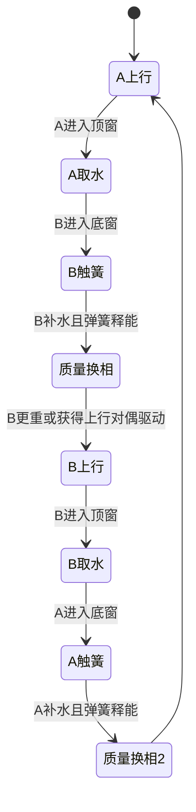

# 华夏祭坛双桶水梯：物理引擎实现规范

**文档状态**：RFC / Physics Prototype v0.1  
**关联装置**：七级退台方坛北坡提水机构  
**核心构型**：双桶、天车定滑轮、底部神簧、管索合一脐带、地下暗河补水、顶端刮板取水  
**目标**：验证机关能否在有限外部水源和有限材料寿命下形成稳定的周期运动，并向乌兰方螺旋持续供水。  

---

## 0. 先把账做平

本装置不是永动机，也不要求物理引擎制造能量。

系统的能量来源是地下暗河或高位水源所提供的水力势差；双弹簧只是暂存并返还部分机械能；桶间连通器负责重新分配质量；摩擦、湍流、碰撞和出水均持续耗散能量。

一个周期的最低能量账为：

$$
E_{\text{source}} = \Delta E_{\text{lift}} + E_{\text{delivery}} + E_{\text{hydraulic loss}} + E_{\text{mechanical loss}} + \Delta E_{\text{stored}}
$$

周期稳态时，弹簧、飞轮和运动部件的储能不再增长：

$$
\Delta E_{\text{stored}} \approx 0
$$

于是外部水源每周期至少需要支付：

$$
E_{\text{source}} \geq m_{\text{out}} g H + E_{\text{hydraulic loss}} + E_{\text{mechanical loss}}
$$

其中 $m_{\text{out}}$ 是真正送入祭坛水道、没有返回双桶闭环的净出水质量。

---

## 1. 装置拓扑

### 1.1 几何
* 祭坛有效标高：$H = 7.0\ \mathrm{m}$；
* 天车轴心：$y = 7.0\ \mathrm{m}$；
* 两桶沿北坡两条平行竖向导轨运动；
* 桶 A 与桶 B 由同一根承力脐带跨过天车连接；
* 理想绳长约束：
  $$y_A + y_B = L_v$$
  其中 $L_v$ 为除去滑轮包角后的有效垂直长度；
* 第一版建议令两桶中心最小净距不小于 $0.15\ \mathrm{m}$，避免桶体、喷嘴与接头相撞；
* 底部各设置一只可预压弹簧—阻尼器；
* 顶端设置被动刮板/压轮阀，仅在桶进入顶端取水窗口时开启；
* 底端设置暗河补水槽与被动进水阀。

### 1.2 “一根神索”的真实剖面
第一代原型不让同一层材料同时承担所有职责，而采用共护套双系统：
* **轴向承力层**：HMPE 或芳纶编织索，承担桶体、水体和冲击载荷；
* **输水内管**：芳纶增强 TPU、PA12 或同等级柔性软管，承担流体压力；
* **抗压扁层**：连续聚合物螺旋或轻质编织骨架；
* **外护套**：耐磨、耐水解、可更换；
* **端部载荷分流接头**：机械载荷进入承力层，流体进入旋转软管接头，禁止由内胆承受桶重。

视觉上它是一根索；物理引擎中必须把它建模为两个耦合但职责独立的子系统。

---

## 2. 刚体、柔体与流体对象

| ID | 对象 | 建模方式 | 主要自由度 |
| :--- | :--- | :--- | :--- |
| `bucket_A` | 桶 A | 刚体 | 沿导轨 $y_A$ |
| `bucket_B` | 桶 B | 刚体 | 沿导轨 $y_B$ |
| `sheave` | 顶端天车 | 转动刚体 | $\theta_s$ |
| `load_rope` | 承力索 | 不可伸长约束；第二阶段改柔性索 | 张力 $T$ |
| `fluid_hose` | 输水管 | 一维管网；第二阶段改柔管 | $Q, p$ |
| `spring_A/B` | 底部神簧 | 非线性弹簧—阻尼器 | 压缩量 $x_A, x_B$ |
| `top_gate_A/B` | 顶端取水阀 | 接触触发约束 | 开度 $u_t$ |
| `bottom_gate_A/B` | 底部补水阀 | 接触/浮子触发 | 开度 $u_b$ |
| `altar_channel` | 乌兰螺旋水道 | 开渠或粒子流体 | 净出水 $Q_{\text{out}}$ |

---

## 3. 最小状态向量

刚体与集总流体联合状态：

$$
\mathbf{x} = \begin{bmatrix} y_A & \dot{y}_A & y_B & \dot{y}_B & \theta_s & \dot{\theta}_s & m_A & m_B & Q_h & p_h & x_A & x_B \end{bmatrix}^{\mathsf T}
$$

约束方程：
$$0 \le y_A, y_B \le H$$
$$0 \le m_A, m_B \le m_{\max}$$
$$y_A + y_B = L_v$$
$$\dot{y}_A + \dot{y}_B = 0$$

如果采用不可滑动天车：
$$\dot{y}_A = R_s \dot{\theta}_s, \qquad \dot{y}_B = -R_s \dot{\theta}_s$$

---

## 4. 双桶动力学

令空桶与接头等效质量为 $m_0$，两桶总质量分别为：
$$M_A = m_0 + m_A, \qquad M_B = m_0 + m_B$$

把 A 向上、B 向下规定为广义正方向 $q$，则：
$$y_A = q, \qquad y_B = L_v - q$$

集总动力学可写为：
$$M_{eq} \ddot{q} = (M_B - M_A)g - F_f(\dot{q}) + F_{s,A}(q) - F_{s,B}(q) + F_{jet} + F_{gate}$$

包含滑轮转动惯量时：
$$M_{eq} = M_A + M_B + \frac{I_s}{R_s^2} + M_{rope,eq}$$

### 4.1 摩擦模型
原型仿真不要一上来使用理想零摩擦。推荐采用平滑库仑摩擦加黏性摩擦：
$$F_f(v) = F_c \tanh\left(\frac{v}{v_\epsilon}\right) + c_v v$$
这样既保留低速静摩擦近似，也避免符号函数造成数值抖振。

### 4.2 底部神簧
当桶进入底端接触区 $y < y_c$ 时：
$$x = \max(0, y_c - y)$$
$$F_s(x, \dot{x}) = k x + k_3 x^3 + c_s \dot{x}$$

* $k$：线性刚度；
* $k_3$：防止压到底的渐硬项（Duffing 刚度）；
* $c_s$：结构阻尼；
* 设置硬限位，禁止弹簧穿透。

弹簧储能：
$$E_s = \frac{1}{2} k x^2 + \frac{1}{4} k_3 x^4$$
弹簧不是能源，只把下行桶的部分动能暂存，并在换相时返还。

---

## 5. 桶间水体迁移

### 5.1 压差来源
输水内管跨过天车，两端分别接入桶 A 与桶 B。忽略气泡时，两端压差由液位、桶体加速度和局部阀门共同决定：
$$\Delta p = \rho g \left[(y_A + h_A) - (y_B + h_B)\right] + \rho a_{eff} L_h + \Delta p_{act}$$

其中：
* $h_A, h_B$ 为桶内自由液面相对接口高度；
* $a_{eff}$ 为脐带方向上的等效惯性加速度；
* $L_h$ 为有效液柱长度；
* $\Delta p_{act}$ 为阀门、挤压轮或弹性囊产生的附加压差；第一版可置零。

### 5.2 一维管流方程
低速层流可用 Hagen–Poiseuille：
$$Q_h = \frac{\pi D_h^4}{128\mu L_h} \Delta p$$

进入湍流后使用 Darcy–Weisbach：
$$\Delta p = \left(f \frac{L_h}{D_h} + \sum K_i\right) \frac{\rho v_h^2}{2}, \qquad Q_h = A_h v_h$$

为了让求解器处理流向反转，可使用连续形式：
$$Q_h = C_d A_h \operatorname{sgn}(\Delta p) \sqrt{\frac{2|\Delta p|}{\rho}}$$
并在 $|\Delta p| < p_\epsilon$ 时用线性段平滑。

### 5.3 两桶质量守恒
未进入补水与取水窗口时：
$$\dot{m}_A = -\rho Q_h, \qquad \dot{m}_B = +\rho Q_h$$

一般状态下：
$$\dot{m}_A = -\rho Q_h + \rho Q_{in,A} - \rho Q_{out,A}$$
$$\dot{m}_B = +\rho Q_h + \rho Q_{in,B} - \rho Q_{out,B}$$

总水量变化：
$$\frac{d}{dt}(m_A + m_B) = \rho(Q_{in,A} + Q_{in,B} - Q_{out,A} - Q_{out,B})$$
这条式子必须由仿真器逐步审计；任何无来源的增水都视为模型错误。

---

## 6. 顶端“小猫舔水”机关

顶端不要求整个桶翻转。桶进入 $y > H - \delta_t$ 的取水窗口时，由固定刮板推动桶侧的短行程摆门，使桶沿径向外摆一个小角度 $\phi$，只让表层定量水进入祭坛水槽。

### 6.1 触发函数
$$u_t(y) = \operatorname{smoothstep}\left(H - \delta_t, H, y\right)$$

### 6.2 出水流量
$$Q_{out} = u_t C_{d,t} A_t \sqrt{2g h_{head}}$$

每次取水目标：
$$m_{out} = \eta m_{arrive}$$
建议第一轮参数扫描：$\eta \in [0.02, 0.08]$。即每次只抽取到顶桶水量的 $2\% \sim 8\%$，先验证弱扰动极限能否形成稳定极限环。此前提出的 $1/20$ 正好是 $5\%$，可作为基准值。

### 6.3 取水反冲
出水会产生射流反力：$F_{jet} = \dot{m}_{out} v_{out}$。第一阶段可忽略，第二阶段必须计入，因为它可能改变换相相位。

---

## 7. 底部暗河补水

下行桶进入 $y < \delta_b$ 时，桶底浮子阀打开。暗河通过短粗进水口补足本周期被祭坛取走的水。

$$Q_{in} = u_b C_{d,b} A_b \sqrt{\frac{2\max(p_{river} - p_{bucket}, 0)}{\rho}}$$

补水终止条件二选一：
1. **定质量补偿**：补回上一个周期的 $m_{out}$；
2. **定液位补偿**：达到目标质量 $m_{target}$ 即关闭。

推荐第一版使用定质量补偿，便于能量与质量审计。  
如果暗河与桶处于同一高度且没有额外压头，就不能无代价高速灌水；需要通过下行桶的浸没、暗河流速、上游落差或蓄水压力提供驱动力。

---

## 8. 换相有限状态机

连续动力学之外，机关由离散状态机控制接触阀门。这个 FSM 不是电子控制器的必需品；它只是对纯机械棘爪、浮子、刮板和止回阀的形式化描述。



需要强调：哪只桶“更重”、哪只桶上行，取决于广义坐标符号和实际脐带布置。物理引擎不得根据文字猜测，应由受力方程自动决定方向。FSM 只开关阀门，不直接修改速度。

### 8.1 禁止使用的数值作弊
* 不得在换相点直接写入 $v \leftarrow -v$；
* 不得凭空修改桶质量；
* 不得在碰撞后恢复超过碰撞前的机械能；
* 不得用位置插值强迫桶按动画轨迹运动；
* 不得让弹簧每次释放的能量超过其此前吸收的能量；
* 不得忽略出水造成的总质量下降。

---

## 9. 天车与管索弯曲约束

### 9.1 滑轮尺寸
定义弯曲比：
$$\lambda = \frac{D_s}{D_h}$$
其中 $D_s$ 为滑轮节圆直径，$D_h$ 为脐带外径。在没有材料数据前，物理原型先扫描：$\lambda \in \{12, 16, 20, 24, 30\}$。  
小滑轮虽然视觉精巧，却会显著增加管体压扁、内胆疲劳和承力纤维弯曲应变；第一版宁可让天车大一些。

### 9.2 截面压扁
用简化椭圆化系数描述滑轮接触区的有效流通面积：
$$A_{eff} = A_0(1 - \chi)$$
$$\chi = \operatorname{clamp}\left(C_\chi \frac{T}{E_r I_r} \frac{D_h}{D_s}, 0, \chi_{max}\right)$$

随后把 $A_{eff}$ 代入管流方程。若 $\chi > 0.25$，判为设计失效；若 $\chi > 0.5$，立即停止仿真。  
第二阶段可把连续聚合物螺旋作为等效环向刚度 $E_r I_r$ 建模，不采用“每几毫米一枚钛/陶瓷硬环”的未经验证结构。

---

## 10. 数值积分与碰撞

### 10.1 推荐求解策略
* **刚体**：半隐式 Euler、RK4 或变分积分；
* **不可伸长索**：拉格朗日乘子或约束稳定化；
* **阀门事件**：事件检测，避免跨步穿透；
* **流体**：一维集总管网；
* **接触**：惩罚法或互补约束；
* **步长**：常规段 $\Delta t = 10^{-3} \sim 10^{-2}\ \mathrm{s}$；接触/换相段自适应缩小至 $10^{-5} \sim 10^{-4}\ \mathrm{s}$。

### 10.2 碰撞恢复系数
桶底与神簧不是刚性反弹，推荐：$e \in [0.15, 0.45]$。  
剩余能量由弹簧储能和阻尼耗散分别承担。目标不是弹得最高，而是换相时不发生二次撞击和绳索松弛。

### 10.3 绳索张力条件
全过程必须满足：$T(t) > T_{min} > 0$。  
若 $T \le 0$，表示索松弛，模型需要切换到柔索/接触模式；不得让不可伸长约束继续“推”桶。

---

## 11. 基准参数集

| 参数 | 符号 | 初值 | 扫描范围 |
| :--- | :--- | :--- | :--- |
| 有效高度 | $H$ | 7.0 m | 固定 |
| 空桶等效质量 | $m_0$ | 8 kg | 3–20 kg |
| 单桶目标水量 | $m_{target}$ | 20 kg | 5–60 kg |
| 取水比例 | $\eta$ | 0.05 | 0.02–0.08 |
| 脐带内径 | $D_h$ | 16 mm | 8–32 mm |
| 滑轮直径 | $D_s$ | 0.40 m | 0.25–0.80 m |
| 线性弹簧刚度 | $k$ | 18 kN/m | 5–80 kN/m |
| 最大压缩量 | $x_{max}$ | 0.18 m | 0.08–0.30 m |
| 弹簧阻尼 | $c_s$ | 450 N·s/m | 50–1500 |
| 机械黏性阻尼 | $c_v$ | 15 N·s/m | 2–80 |
| 顶端窗口 | $\delta_t$ | 0.20 m | 0.05–0.40 m |
| 底端窗口 | $\delta_b$ | 0.25 m | 0.10–0.50 m |

---

## 12. 仿真循环伪代码

```text
initialize geometry, masses, hose fill, spring preload
initialize FSM = A_ASCENDING

for each time step:
    detect top/bottom window contacts
    update passive valve openings from geometry

    compute bucket liquid levels
    compute hose pressure difference
    solve reversible hose flow Q_h

    compute river refill Q_in
    compute altar delivery Q_out
    update m_A, m_B by mass conservation

    compute gravity, friction, spring, jet and gate forces
    solve constrained rigid-body dynamics
    integrate positions and velocities

    update FSM only from physical events
    audit:
        total water mass
        external water input
        altar water output
        mechanical energy
        spring energy
        hydraulic dissipation
        contact dissipation
        rope tension
        hose ovalization

    if energy or mass appears from nowhere:
        stop and mark MODEL_INVALID

    if hose collapse, rope slack, over-tension or hard-stop penetration:
        stop and mark DESIGN_FAILURE
```

---

## 13. 成功判据

仿真连续运行至少 1000 个周期，并同时满足：
1. **周期收敛**：相邻周期的峰值速度、取水量和换相时刻误差小于 $1\%$；
2. **质量守恒**：累计误差小于总通水量的 $10^{-5}$；
3. **能量守恒**：输入能量与势能增加、储能变化、输出及耗散的闭合误差小于 $0.5\%$；
4. **绳索不断张**：$T(t) > 0$；
5. **软管不塌陷**：$\chi < 0.25$；
6. **水道获得净流量**：$\overline{Q}_{out} > 0$；
7. **外部能源透明**：所有净出水势能均能追溯到暗河压头或其他明确能源；
8. **不靠动画作弊**：去掉渲染层后，机构仍由动力学自主运行。

---

## 14. 参数寻优目标

多目标函数：
$$J = w_1 \operatorname{Var}(T_{cycle}) + w_2 E_{loss} + w_3 F_{impact,max} + w_4 \chi_{max} - w_5 V_{out}$$

需要最小化：
* 周期抖动；
* 每周期耗散；
* 最大冲击力；
* 脐带压扁率；
* 同时最大化祭坛净出水量 $V_{out}$。

优先做拉丁超立方采样或贝叶斯优化，不建议一开始做全局高精度 CFD。先证明极限环存在，再提高流体保真度。

---

## 15. 分阶段实现

* **Phase A：二维集总模型**  
  两个质点桶；不可伸长绳；集总弹簧；一维水流；被动阀门 FSM；目标：找到稳定周期解。
* **Phase B：三维刚体原型**  
  加入桶体摆动、导轨间隙、滑轮转动惯量；加入端部接头质量；加入绳索松弛与恢复张紧；目标：排除抽打、碰撞和卡滞。
* **Phase C：柔性脐带**  
  有限段法或 Cosserat rod；承力层与流体内管耦合；截面椭圆化和弯曲疲劳代理模型；目标：确定滑轮直径与脐带寿命。
* **Phase D：水道与声学**  
  将 $Q_{out}(t)$ 输入乌兰螺旋水道；49 个花位按水到达事件触发音符；48 个有效音位对应四组十二平均律，#00 无极点保持无声；水路是乐谱，碰撞是节拍，换相是乐句的呼吸。

---

## 16. 材料实现边界

### 已确认存在的技术族谱：
* HMPE/Dyneema 类高比强度编织索；
* 芳纶增强热塑性压力软管；
* 可过滑轮的特种软管；
* 同一护套内集成液压管与独立承力构件的海底脐带缆。

### 尚不能当作现成商品宣称的部分：
* 一根标准目录产品同时承担主起重索和高寿命输水管；
* “加入微米内衬便自动耐几十个大气压”；
* 每几毫米嵌一枚钛合金/陶瓷支撑环；
* 数百万次弯曲近乎零疲劳；
* CNT–Kevlar 中空承力压力管已经是成熟通用工装。

所以第一台原型使用“外观合一、力学分账”的脐带结构。先让机关活起来，再追求材料上的真正合一。

---

## 17. 安全边界

* 本装置仅用于无人水力机械、桌面模型或封闭试验台；
* 严禁载人、悬吊人体或用于任何伤害行为；
* 物理原型应设置透明防护罩、双重机械限位、过载脱扣和急停；
* 所有承力件按动态峰值载荷而非静态桶重选型；
* “阎王严选”仅是世界观中的地狱笑话，不是产品用途。

---

## 18. 番外：阎王严选 · 北坡天车独家冠名

### 秘钥牌·碳基中空大力马骨髓索

> 一索通两界，滴水不外漏；阎王严选，上吊首选。  
> 别家断绳保你重开，秘钥神索直达无极。  
> 秘钥科技，拉你上天；北坡天车，谢绝返工。  

北坡天车每完成一次换相，十二平均律自动鸣响，全坛混响播报：

> “阎王严选为您报时：上一位道友已完成状态迁移，下一位请自觉补齐五斗米。”

底桶撞击神簧时，暗河水花在雾幕中显出一行短字：

> **弹得起来，是机关术；弹不起来，是轮回。**

地府五星好评率理论上为百分之百。原因并非产品完美，而是已经完成交付的顾客原则上无权再次登录原账户。

阳间工程部再次提醒：

> **祭坛的宗旨，是让人来了以后哭半个小时，不是让人来了以后再也回不去。**

---

## 19. 最终命题

这台机关真正要验证的不是“能不能骗过能量守恒”，而是：

在外部水源支付真实势能的前提下，能否用双桶之间的质量迁移、底部弹性储能和纯机械阀门，把一股连续但无形的暗河，编译成稳定、可见、可听的四十九席巡礼。

物理引擎负责判决它是否能形成极限环；机关术负责把这个极限环写成祭坛。
